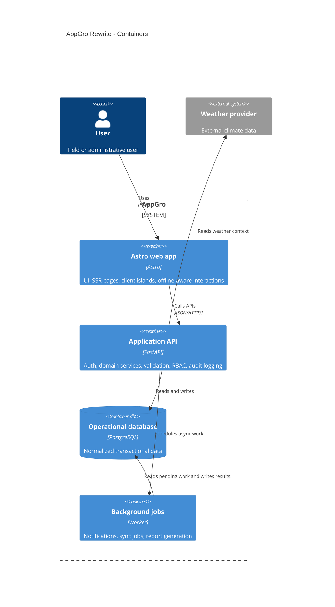

# Context and Containers

## Purpose

Define the main runtime containers and their responsibilities in the rewrite.

## Audience

Developers and technical reviewers preparing frontend and backend structure.

## Source references

- `docs/projectPlan.md`
- `OLD/MainDocumentation/NewTraditionsSolutions.docx.html`
- `OLD/MainDocumentation/Survey/2025 APP-CAMPO.csv`

## Diagram

## Container responsibilities

| Container | Primary responsibilities |
| --- | --- |
| Astro web app | Rendering, forms, client islands, local cache, sync awareness |
| FastAPI API | Auth, validation, multi-tenant scoping, business rules, audit logging |
| PostgreSQL | Durable transactional state and reporting-friendly schema |
| Background jobs | Notifications, imports, periodic summaries, deferred sync handling |

## Design notes

- Module boundaries should match the documentation domains.
- API contracts should be versionable where workflow risk is high.
- Background jobs are a delivery concern, not a place to hide business rules.

## Open questions

- Does the first release need a dedicated queue technology, or can background execution start in-process?
- Which reporting outputs require precomputation versus live query generation?
