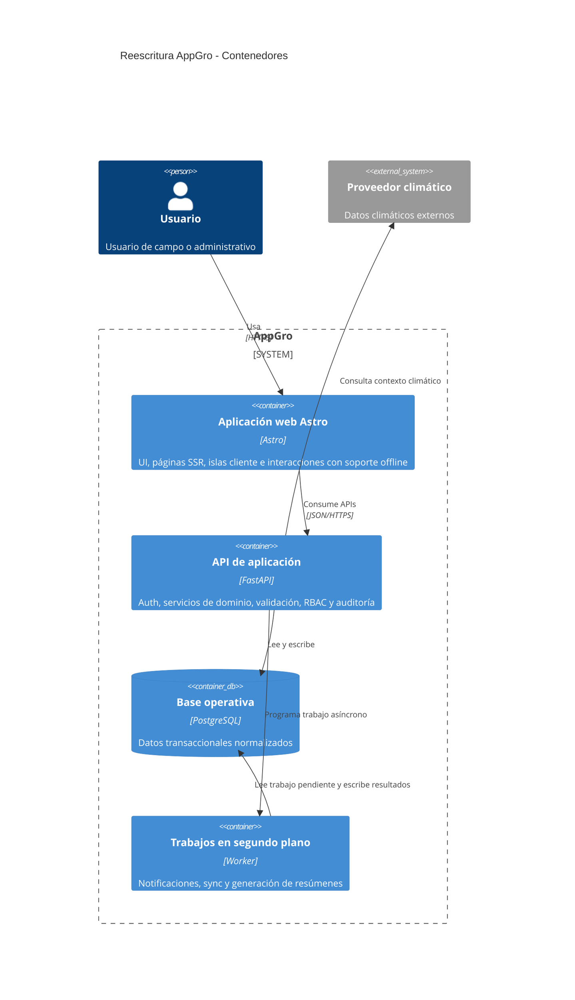

# Contexto y contenedores

## Propósito

Definir los contenedores principales de ejecución y sus responsabilidades en la reescritura.

## Audiencia

Desarrolladores y revisores técnicos que preparan la estructura de frontend y backend.

## Referencias de origen

- `docs/projectPlan.md`
- `OLD/MainDocumentation/NewTraditionsSolutions.docx.html`
- `OLD/MainDocumentation/Survey/2025 APP-CAMPO.csv`

## Diagrama

## Responsabilidades por contenedor

| Contenedor | Responsabilidades principales |
| --- | --- |
| Aplicación Astro | Renderizado, formularios, islas cliente, caché local y awareness de sync |
| API FastAPI | Auth, validación, aislamiento multi-tenant, reglas de negocio y auditoría |
| PostgreSQL | Estado transaccional durable y esquema apto para reporting |
| Trabajos en segundo plano | Notificaciones, importaciones, resúmenes periódicos y sync diferido |

## Notas de diseño

- Los límites de módulos deben coincidir con los dominios documentados.
- Los contratos de API deben poder versionarse donde el riesgo de workflow sea alto.
- Los jobs en segundo plano son una preocupación de entrega, no un lugar para esconder reglas de negocio.

## Preguntas abiertas

- ¿La primera versión necesita una tecnología de cola dedicada o puede empezar con ejecución en proceso?
- ¿Qué salidas de reporting requieren pre-cálculo versus consulta en vivo?
