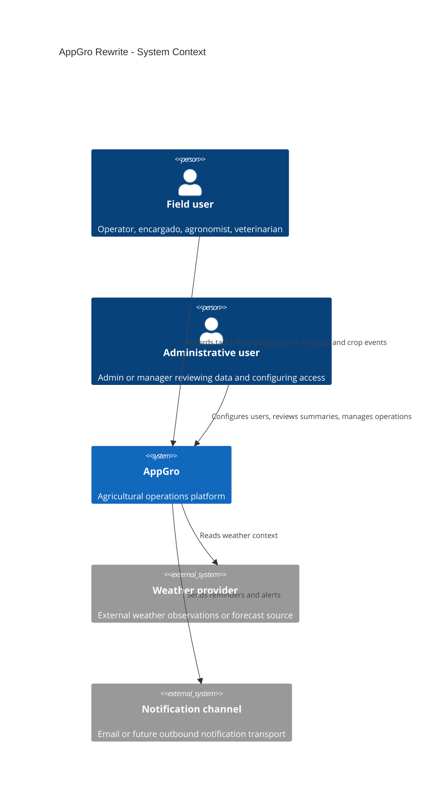

# System Overview

## Purpose

Describe the intended rewrite architecture and delivery philosophy for AppGro.

## Audience

Developers, technical leads, and reviewers preparing implementation work.

## Source references

- `docs/projectPlan.md`
- `OLD/MainDocumentation/NewTraditionsSolutions.docx.html`
- `OLD/MainDocumentation/Survey/2025 APP-CAMPO.csv`

## Design summary

AppGro is a clean-slate rewrite of an agricultural management platform. The rewrite keeps the business intent from legacy discovery while moving to:

- Astro for the web frontend
- FastAPI for backend APIs and server-side business rules
- Mermaid-first documentation for architecture, workflows, and data models

The platform centers on agricultural operations: tasks, livestock, crops, accounting, map sectors/lotes, notifications, weather context, and equipment maintenance.

## Diagram

## Architectural principles

1. Preserve legacy business intent, not legacy implementation details.
2. Keep domain modules cohesive by business boundary.
3. Enforce authentication and authorization on the server.
4. Prefer append-only history where auditability matters.
5. Design APIs and data models before large implementation blocks.
6. Support low-connectivity field workflows where relevant.

## Delivery implications

- Domain and data docs precede implementation-heavy work.
- Shared vocabulary is required across frontend, backend, and docs.
- Offline and manual fallback scenarios should be documented for field-facing flows.

## Open questions

- Which notification channels are required in the first production release?
- How much map editing must be available in the first delivery versus later phases?
- What external weather source should be treated as authoritative?

## Testability notes

- Architecture docs should produce explicit API and data-model follow-up tasks.
- Each module spec should define acceptance criteria that can become backend and integration tests.
