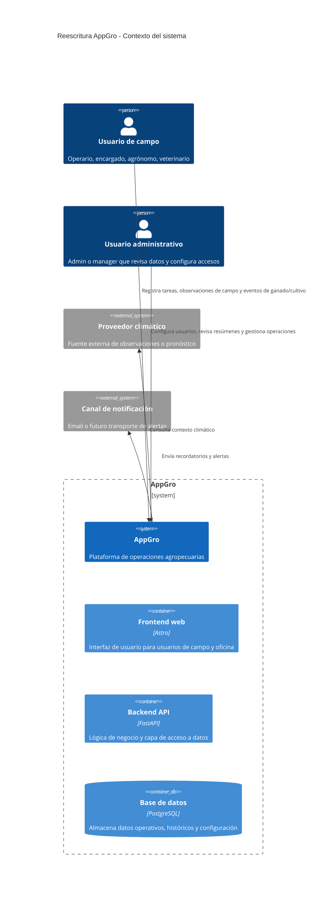

# Visión general del sistema

## Propósito

Describir la arquitectura objetivo y la filosofía de entrega para la reescritura de AppGro.

## Audiencia

Desarrolladores, líderes técnicos y revisores que preparan el trabajo de implementación.

## Referencias de origen

- `docs/projectPlan.md`
- `OLD/MainDocumentation/NewTraditionsSolutions.docx.html`
- `OLD/MainDocumentation/Survey/2025 APP-CAMPO.csv`

## Resumen de diseño

AppGro es una reescritura desde cero de una plataforma de gestión agropecuaria. La reescritura conserva la intención de negocio relevada en el material legado y migra hacia:

- Astro para el frontend web
- FastAPI para APIs backend y reglas de negocio del lado servidor
- Documentación Mermaid-first para arquitectura, flujos y modelos de datos

La plataforma se organiza alrededor de operaciones agropecuarias: tareas, ganado, cultivos, contabilidad, sectores/lotes, notificaciones, contexto climático y mantenimiento de equipos.

## Diagrama

## Principios arquitectónicos

1. Preservar la intención de negocio legada, no los detalles técnicos del stack anterior.
2. Mantener los módulos de dominio cohesionados por límite de negocio.
3. Hacer cumplir autenticación y autorización en el servidor.
4. Preferir historial append-only cuando la auditoría sea importante.
5. Diseñar APIs y modelos de datos antes de grandes bloques de implementación.
6. Soportar flujos de campo con conectividad limitada cuando corresponda.

## Implicancias de entrega

- La documentación de dominio y datos precede al trabajo fuerte de implementación.
- Se requiere vocabulario compartido entre frontend, backend y documentación.
- Los escenarios offline y los respaldos manuales deben documentarse en los flujos de campo.

## Preguntas abiertas

- ¿Qué canales de notificación se requieren en la primera versión productiva?
  - Muy probablemente el email sea el único canal requerido para la versión inicial, ya que es ampliamente utilizado y puede cubrir notificaciones críticas. Sin embargo, deberíamos diseñar el sistema de notificaciones para que sea extensible, de modo que podamos agregar fácilmente canales adicionales como SMS o notificaciones en la aplicación en futuras iteraciones basadas en los comentarios y necesidades de los usuarios.
- ¿Qué nivel de edición del mapa debe existir en la primera entrega y qué puede quedar para después?
  - Una capacidad básica de edición de mapas que permita a los usuarios definir y editar sectores/lotes debería incluirse en la primera entrega, ya que es fundamental para muchos flujos operativos. Características más avanzadas como geocercas, integración con datos GIS externos o edición colaborativa podrían considerarse en fases posteriores una vez que hayamos validado la funcionalidad central y recopilado comentarios de los usuarios sobre la implementación inicial.
- ¿Qué fuente climática externa será la autorizada?
  - WeatherAPI es una opción popular para aplicaciones agrícolas debido a su amplia cobertura de datos y facilidad de integración, pero deberíamos evaluarla frente a otros proveedores según factores como la precisión de los datos en nuestras regiones objetivo, el costo y la fiabilidad de la API. También podríamos diseñar el sistema para admitir múltiples proveedores de clima en caso de que necesitemos cambiar o agregar datos de diferentes fuentes en el futuro.

## Notas de testabilidad

- La documentación de arquitectura debe derivar tareas explícitas para APIs y modelo de datos.
- Cada especificación de módulo debe definir criterios de aceptación convertibles en pruebas backend e integración.
