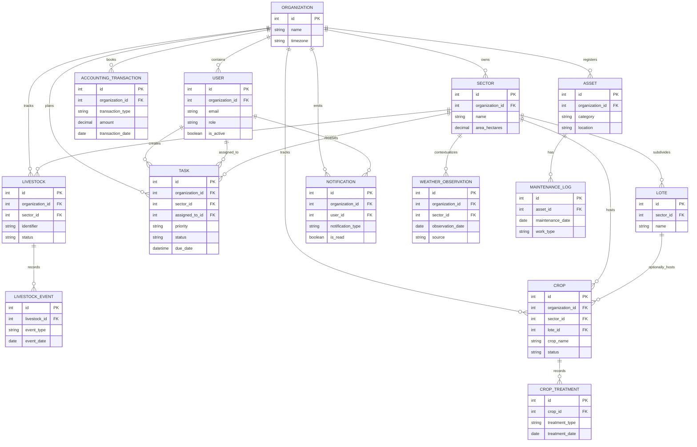

# Core Entity Model

## Purpose

Define the primary entities and relationships that support the AppGro rewrite.

## Audience

Backend implementers, API designers, and reviewers aligning schema with domain behavior.

## Source references

- `docs/projectPlan.md`
- `OLD/MainDocumentation/NewTraditionsSolutions.docx.html`
- `OLD/MainDocumentation/Survey/2025 APP-CAMPO.csv`

## Design summary

The core model is multi-tenant by organization and keeps operational history explicit. Mutable summaries may exist for current state, but audits and field history should remain append-only where business evidence matters.

## Diagram

## Core constraints

- Every operational entity must carry `organization_id` directly or through a parent relationship.
- User email, sector name, and livestock identifier should be unique per organization where applicable.
- Destructive deletes should be avoided for tasks, livestock, crops, and accounting records.
- Audit columns should be standard across mutable entities.

## Cross-module links

- Tasks may reference sectors and drive notifications.
- Livestock, crops, and maintenance can generate accounting context.
- Weather observations enrich crop and task decisions.

## Open questions

- Should maintenance assets support quantity-on-hand and spare-part stock in the same model?
- Will task comments and attachments be part of the first schema wave?

## Testability notes

- Verify organization scoping in every relationship path.
- Verify uniqueness and non-destructive lifecycle rules.
