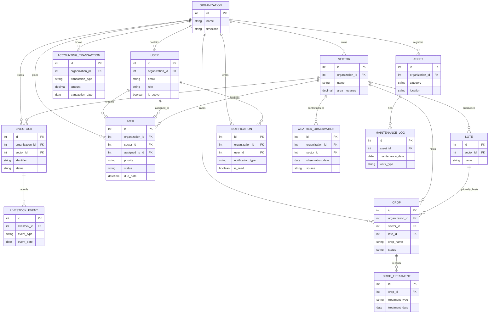

# Modelo de entidades núcleo

## Propósito

Definir las entidades principales y relaciones que soportan la reescritura de AppGro.

## Audiencia

Implementadores backend, diseñadores de API y revisores que alinean esquema con comportamiento de dominio.

## Referencias de origen

- `docs/projectPlan.md`
- `OLD/MainDocumentation/NewTraditionsSolutions.docx.html`
- `OLD/MainDocumentation/Survey/2025 APP-CAMPO.csv`

## Resumen de diseño

El modelo núcleo es multi-tenant por organización y mantiene explícito el historial operativo. Puede existir un resumen mutable del estado actual, pero la auditoría y la historia de campo deben permanecer append-only donde la evidencia de negocio sea importante.

## Diagrama

## Restricciones núcleo

- Toda entidad operativa debe llevar `organization_id` directamente o por relación padre.
- El email del usuario, nombre del sector e identificador de ganado deben ser únicos por organización cuando aplique.
- Deben evitarse borrados destructivos para tareas, ganado, cultivos y contabilidad.
- Las columnas de auditoría deberían ser estándar en entidades mutables.

## Vínculos entre módulos

- Las tareas pueden referenciar sectores y disparar notificaciones.
- Ganado, cultivos y mantenimiento pueden generar contexto contable.
- Las observaciones climáticas enriquecen decisiones sobre cultivos y tareas.

## Preguntas abiertas

- ¿Los activos de mantenimiento deben soportar stock de repuestos y cantidades en el mismo modelo?
  - Esto podría ser una mejora futura, pero inicialmente podemos mantenerlo simple con un solo modelo de activo y considerar las características de gestión de inventario en iteraciones posteriores.
- ¿Los comentarios y adjuntos de tareas entran en la primera ola de esquema?
  - Dado que se planea que las tareas estén vinculadas al historial operativo, podría ser beneficioso incluir tanto comentarios como adjuntos en el diseño inicial para asegurar que capturamos toda la información relevante desde el principio, pero también podríamos considerar agregar estas características en una iteración posterior si queremos centrarnos primero en la funcionalidad principal de las tareas.
- ¿Deberíamos modelar las etapas de crecimiento de los cultivos o la fenología explícitamente, o inferirlas a partir del historial de tratamientos y observaciones?
  - El modelado explícito de las etapas de crecimiento podría proporcionar información valiosa y capacidades de reporte, pero también añade complejidad. Podríamos comenzar infiriendo las etapas de crecimiento a partir del historial de tratamientos y observaciones y considerar agregar el seguimiento fenológico explícito en iteraciones futuras basándonos en los comentarios y necesidades de los usuarios.

## Notas de testabilidad

- Verificar alcance por organización en cada camino relacional.
- Verificar unicidad y reglas de ciclo de vida no destructivas.
