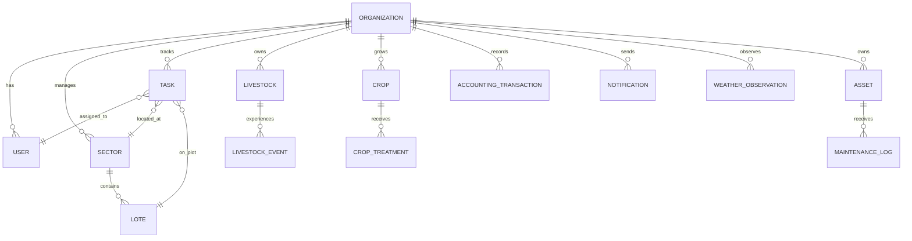

# Database Schema — SQLModel Implementation

## Overview

AppGro backend uses **SQLModel** (Pydantic + SQLAlchemy hybrid) + PostgreSQL for persistent storage. All entities follow org-scoped multi-tenant design with soft-delete and audit columns.

## Core Principles

### 1. Multi-Tenant Isolation
Every operational entity carries `organization_id` or inherits via FK parent. Queries must filter by org to prevent cross-tenant data leaks.

```python
# ✓ Org-scoped
sector = session.exec(
    select(Sector)
    .where(Sector.organization_id == current_user.organization_id)
).first()

# ✗ Cross-tenant leak risk
sector = session.exec(select(Sector).where(Sector.id == sector_id)).first()
```

### 2. Soft Deletes
Records use `is_archived: bool = False` instead of hard DELETE. Preserves audit trail and allows recovery.

```python
# Archive (soft delete)
task.is_archived = True
session.add(task)
session.commit()

# Query excludes archived by default
active_tasks = session.exec(
    select(Task)
    .where(Task.is_archived == False)
).all()
```

### 3. Audit Columns
All entities have:
- `created_at: datetime` — record creation time
- `updated_at: datetime` — last modification time

Used for compliance, debugging, and temporal queries.

### 4. Base Models & Mixins

```python
# Base with timestamps
class BaseModel(SQLModel, TimestampMixin):
    created_at: datetime = Field(default_factory=datetime.utcnow)
    updated_at: datetime = Field(default_factory=datetime.utcnow)

# Org-scoped base
class OrgScopedModel(BaseModel, OrgScopedMixin):
    organization_id: int = Field(foreign_key="organization.id")
```

Every operational entity inherits from one of these.

## Entity Relationships



## Entity Details

### Organization (Root Tenant)
Root tenant entity. All operational records scoped to organization.

| Field | Type | Notes |
|-------|------|-------|
| id | int (PK) | Unique tenant ID |
| name | str | Org name |
| email | str \| null | Contact email |
| address | str \| null | Physical address |
| phone | str \| null | Contact phone |
| is_active | bool | Soft disable orgs |
| created_at | datetime | Creation time |
| updated_at | datetime | Last update |

### User (Org-Scoped)
User accounts with role-based access.

| Field | Type | Notes |
|-------|------|-------|
| id | int (PK) | User ID |
| organization_id | int (FK) | Tenant |
| email | str (unique per org) | Login |
| hashed_password | str | bcrypt hash |
| full_name | str | Display name |
| role | str | admin \| manager \| operator \| viewer |
| is_active | bool | Soft disable users |
| created_at | datetime | Registration |
| updated_at | datetime | Last update |

**Unique Constraint**: (organization_id, email) — same email allowed in different orgs.

### Sector (Land Area)
Operational land grouping.

| Field | Type | Notes |
|-------|------|-------|
| id | int (PK) | Sector ID |
| organization_id | int (FK) | Tenant |
| name | str | Sector name |
| area_hectares | float \| null | Land size |
| location_notes | str \| null | GPS/description |
| is_active | bool | Operational status |
| created_at | datetime | Created |
| updated_at | datetime | Updated |

### Lote (Plot)
Plot subdivision within sector. Smallest operational unit for crop/livestock.

| Field | Type | Notes |
|-------|------|-------|
| id | int (PK) | Plot ID |
| organization_id | int (FK) | Tenant |
| sector_id | int (FK) | Parent sector |
| name | str | Plot name |
| area_hectares | float \| null | Plot area |
| soil_type | str \| null | Soil classification |
| is_active | bool | Operational |
| created_at | datetime | Created |
| updated_at | datetime | Updated |

### Task (Work Unit)
Operational task with assignment + tracking.

| Field | Type | Notes |
|-------|------|-------|
| id | int (PK) | Task ID |
| organization_id | int (FK) | Tenant |
| title | str | Task title |
| description | str \| null | Details |
| priority | int | 1 (high) to 5 (low) |
| status | str | pending \| in_progress \| completed \| archived |
| assigned_to_user_id | int (FK) \| null | Single owner |
| due_date | str \| null | ISO date |
| sector_id | int (FK) \| null | Related sector |
| lote_id | int (FK) \| null | Related plot |
| is_archived | bool | Soft delete |
| created_at | datetime | Created |
| updated_at | datetime | Updated |

**Future**: Multi-assignee support via junction table.

### Livestock (Animal)
Animal tracking by lifecycle.

| Field | Type | Notes |
|-------|------|-------|
| id | int (PK) | Animal ID |
| organization_id | int (FK) | Tenant |
| identifier | str | Ear tag / caravana |
| animal_type | str | bovine \| ovine \| etc |
| breed | str \| null | Breed name |
| birth_date | str \| null | ISO date |
| weight_kg | float \| null | Current weight |
| is_archived | bool | Soft delete |
| created_at | datetime | Created |
| updated_at | datetime | Updated |

### LivestockEvent (Health/Incident)
Health event, vaccination, or incident record for animal.

| Field | Type | Notes |
|-------|------|-------|
| id | int (PK) | Event ID |
| organization_id | int (FK) | Tenant |
| livestock_id | int (FK) | Animal |
| event_type | str | vaccination \| treatment \| incident \| death |
| event_date | str | ISO date when event occurred |
| notes | str \| null | Clinical notes |
| created_at | datetime | Record created |
| updated_at | datetime | Record updated |

### Crop (Planting Record)
Crop lifecycle tracking tied to sector/lote.

| Field | Type | Notes |
|-------|------|-------|
| id | int (PK) | Crop record ID |
| organization_id | int (FK) | Tenant |
| crop_type | str | soybean \| corn \| wheat \| etc |
| sector_id | int (FK) \| null | Crop location |
| lote_id | int (FK) \| null | Specific plot |
| planting_date | str \| null | ISO date |
| harvest_date | str \| null | ISO date |
| quantity_planted | float \| null | Amount |
| quantity_harvested | float \| null | Yield |
| unit | str \| null | kg \| qq \| liters \| ha |
| is_archived | bool | Soft delete |
| created_at | datetime | Created |
| updated_at | datetime | Updated |

### CropTreatment (Application)
Application of input: pesticide, fungicide, fertilizer, irrigation.

| Field | Type | Notes |
|-------|------|-------|
| id | int (PK) | Treatment ID |
| organization_id | int (FK) | Tenant |
| crop_id | int (FK) | Crop record |
| treatment_type | str | pesticide \| fungicide \| irrigation \| fertilizer |
| treatment_date | str | ISO date applied |
| product_name | str \| null | Brand/chemical name |
| quantity | float \| null | Amount applied |
| notes | str \| null | Application notes |
| is_archived | bool | Soft delete (config per org) |
| created_at | datetime | Created |
| updated_at | datetime | Updated |

### AccountingTransaction (Financial Record)
Income or expense transaction.

| Field | Type | Notes |
|-------|------|-------|
| id | int (PK) | Transaction ID |
| organization_id | int (FK) | Tenant |
| transaction_type | str | income \| expense |
| amount | float | Currency units |
| category | str | seeds \| feed \| labor \| equipment \| etc |
| transaction_date | str | ISO date |
| description | str \| null | Details |
| related_task_id | int (FK) \| null | Related task |
| created_at | datetime | Created |
| updated_at | datetime | Updated |

### Notification (Event Alert)
User notification for task due, event alert, or system message.

| Field | Type | Notes |
|-------|------|-------|
| id | int (PK) | Notification ID |
| organization_id | int (FK) | Tenant |
| user_id | int (FK) | Recipient |
| title | str | Title |
| message | str | Body |
| notification_type | str | task \| alert \| info |
| is_read | bool | Read status |
| created_at | datetime | Created |
| updated_at | datetime | Updated |

### WeatherObservation (Event Record)
Weather event observation relevant to operations.

| Field | Type | Notes |
|-------|------|-------|
| id | int (PK) | Observation ID |
| organization_id | int (FK) | Tenant |
| sector_id | int (FK) \| null | Location |
| observation_date | str | ISO date |
| weather_type | str | rain \| frost \| heat \| hail \| etc |
| notes | str \| null | Details |
| created_at | datetime | Created |
| updated_at | datetime | Updated |

### Asset (Equipment/Infrastructure)
Equipment and infrastructure (herramientas).

| Field | Type | Notes |
|-------|------|-------|
| id | int (PK) | Asset ID |
| organization_id | int (FK) | Tenant |
| name | str | Asset name |
| asset_type | str | equipment \| fencing \| irrigation \| etc |
| purchase_date | str \| null | ISO date |
| status | str | active \| maintenance \| retired |
| is_archived | bool | Soft delete |
| created_at | datetime | Created |
| updated_at | datetime | Updated |

### MaintenanceLog (Service Record)
Asset maintenance history.

| Field | Type | Notes |
|-------|------|-------|
| id | int (PK) | Log ID |
| organization_id | int (FK) | Tenant |
| asset_id | int (FK) | Equipment |
| maintenance_date | str | ISO date |
| maintenance_type | str | repair \| preventive \| inspection |
| notes | str \| null | Work done |
| cost | float \| null | Expense |
| created_at | datetime | Created |
| updated_at | datetime | Updated |

## Migration Strategy

Schema managed via **Alembic** version control.

### Commands

```bash
# Create initial migration (auto-detect model changes)
alembic revision --autogenerate -m "description"

# Apply pending migrations to DB
alembic upgrade head

# Rollback one migration
alembic downgrade -1

# Show current revision
alembic current
```

### Workflow

1. **Modify SQLModel**: Add field, constraint, or entity in `app/models/`
2. **Generate**: `alembic revision --autogenerate -m "add field x"`
3. **Review**: Check generated SQL in `migrations/versions/*.py`
4. **Apply**: `alembic upgrade head` on target DB
5. **Test**: Run integration tests to verify org isolation + soft-delete

## Connection & Session

FastAPI dependency injection:

```python
from app.db import get_session
from fastapi import Depends

@app.get("/sectors")
def list_sectors(session: Session = Depends(get_session)):
    return session.exec(
        select(Sector)
        .where(Sector.organization_id == current_user.organization_id)
    ).all()
```

## Index Strategy

All FK + org_id columns indexed for:
- Fast org scoping queries
- Efficient multi-tenant isolation
- Reasonable join performance

Primary keys + FK relationships automatically indexed by PostgreSQL.

## Soft-Delete Pattern

Do NOT hard-delete. Instead:

```python
# Archive
record.is_archived = True
session.add(record)
session.commit()

# Query active records (default)
active = session.exec(select(Entity).where(Entity.is_archived == False))

# Query include archived (explicitly)
all_records = session.exec(select(Entity))
```

Service layer should default to `is_archived == False` filter.

## Future Enhancements

- [ ] User-defined roles + permission matrix
- [ ] Task multi-assignee via junction table
- [ ] Crop rotation tracking
- [ ] Financial summaries + reporting
- [ ] Automated weather alerts
- [ ] Mobile app integration (same backend)
