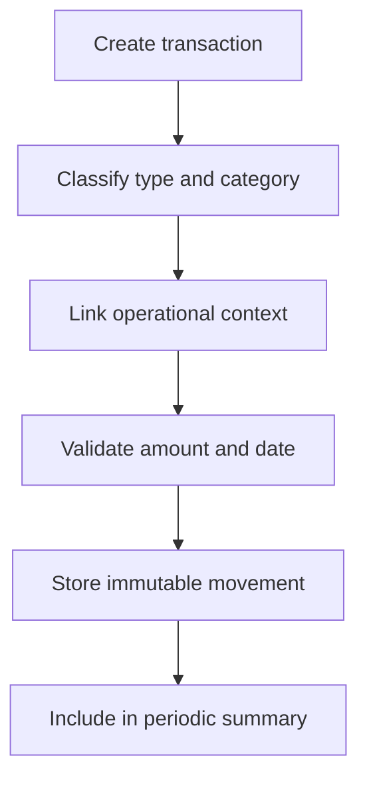

# Accounting Specification

## Purpose

Define financial records for purchases, sales, expenses, income, and periodic summaries.

## Audience

Developers implementing accounting and reporting behavior.

## Source references

- `OLD/MainDocumentation/Survey/2025 APP-CAMPO.csv`
- `docs/projectPlan.md`

## Design summary

Accounting must capture both generic financial movement and agricultural context. Transactions may reference crops, livestock, sectors, or maintenance work. Periodic summaries should support weekly, monthly, and yearly review.

## Diagram

## Business rules and constraints

- Transaction type should distinguish purchase, sale, expense, and income.
- Deleting confirmed transactions should be avoided; use reversal entries.
- Purchase and sale records should retain invoice/reference details where available.
- Summaries should aggregate by period and category.

## Roles and permissions implications

- Managers and admins create and adjust financial records.
- Viewers may read summary data only.

## Edge cases

- Negative amounts should be validated against transaction type rules.
- Reversals must remain linked to original entries.
- Operational links may be optional but must be structured when present.

## Open questions

- Is multi-currency support needed in the first release?
- Should accounting periods be generated automatically or manually closed?

## Testability notes

- Verify transaction validation rules.
- Verify summary aggregation by period and category.
- Verify reversal and audit behavior.
