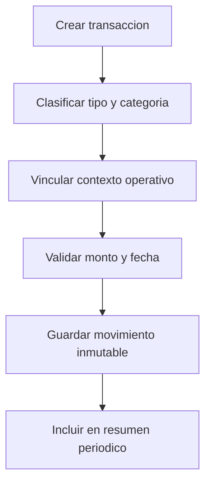

# Especificación de contabilidad

## Propósito

Definir registros financieros para compras, ventas, gastos, ingresos y resúmenes periódicos.

## Audiencia

Desarrolladores que implementan comportamiento contable y reporting.

## Referencias de origen

- `OLD/MainDocumentation/Survey/2025 APP-CAMPO.csv`
- `docs/projectPlan.md`

## Resumen de diseño

La contabilidad debe capturar tanto el movimiento financiero general como el contexto agropecuario. Las transacciones pueden referenciar cultivos, ganado, sectores o tareas de mantenimiento. Los resúmenes periódicos deben soportar revisión semanal, mensual y anual.

## Diagrama

## Reglas y restricciones

- El tipo de transacción debe distinguir purchase, sale, expense e income.
- Debe evitarse borrar transacciones confirmadas; usar asientos reversos.
- Las compras y ventas deben conservar factura o referencia cuando exista.
- Los resúmenes deben agregar por período y categoría.

## Implicancias de roles y permisos

- Managers y admins crean y ajustan registros financieros.
- Viewers solo leen datos resumen.

## Casos borde

- Los montos negativos deben validarse según el tipo de transacción.
- Los reversos deben quedar vinculados al asiento original.
- Los vínculos operativos pueden ser opcionales, pero estructurados cuando existan.

## Preguntas abiertas

- ¿Se necesita soporte multi-moneda en la primera versión?
  - Muy probablemente sí, ya que la moneda local puede no ser la única utilizada para transacciones, especialmente para ventas o compras que involucren proveedores o clientes externos.
- ¿Deberíamos soportar reversos parciales o ajustes, o solo reversos completos de transacciones?
  - Los ajustes parciales podrían ser útiles para corregir errores sin perder el historial original de transacciones, pero añaden complejidad. Podríamos comenzar con reversos completos y considerar ajustes parciales en iteraciones futuras.
- ¿Los períodos contables se generan automáticamente o se cierran manualmente?
  - Esto depende del flujo de trabajo deseado por el usuario, esta funcionalidad debería permitir ambas opciones, con generación automática de períodos basada en fechas del calendario y la capacidad de que los usuarios cierren manualmente los períodos cuando estén listos.

## Notas de testabilidad

- Verificar reglas de validación de transacciones.
- Verificar agregación por período y categoría.
- Verificar reversos y auditoría.
