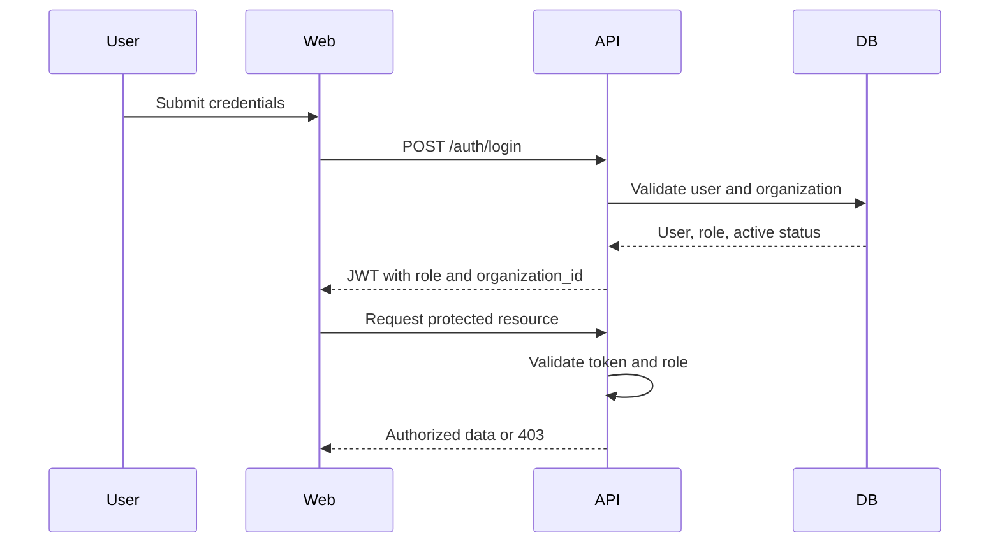

# Auth and Permissions Specification

## Purpose

Define authentication, role-based authorization, and organization isolation for AppGro.

## Audience

Backend and frontend implementers.

## Source references

- `docs/projectPlan.md`
- `OLD/MainDocumentation/Survey/2025 APP-CAMPO.csv`

## Design summary

AppGro should use JWT-based authentication and server-side RBAC. All data access is scoped to the active organization. Field job titles such as `encargado`, `peon`, `agronomo`, and `veterinario` map to system roles and optional sector-specific permissions later.

## Diagram

## Business rules and constraints

- JWT payload must include user id, role, and organization id.
- Authorization must be enforced in the service layer, not only in routes.
- Operators can act only on assigned or explicitly allowed records.
- Sensitive changes must be audit logged.

## Roles and permissions implications

- Admin: user management, configuration, full exports
- Manager: operational management and reporting
- Operator: field execution and limited updates
- Viewer: read-only visibility

## Edge cases

- Inactive users must fail authentication.
- Tokens from another organization must never resolve records cross-tenant.
- Permission failures must not leak internal details.

## Open questions

- Is refresh-token support required in the first release?
  - May not be necessary if token expiration is reasonably long and users log in daily, could be optionally implemented with "remember me" functionality.
- Will specialist roles need distinct UI behavior beyond shared RBAC roles?
  -  This could be a nice-to-have for future iterations, but initially we can focus on core RBAC and add UI nuances later.

## Testability notes

- Verify role matrix per endpoint and service.
- Verify cross-organization access denial.
- Verify audit-log creation on sensitive mutations.
