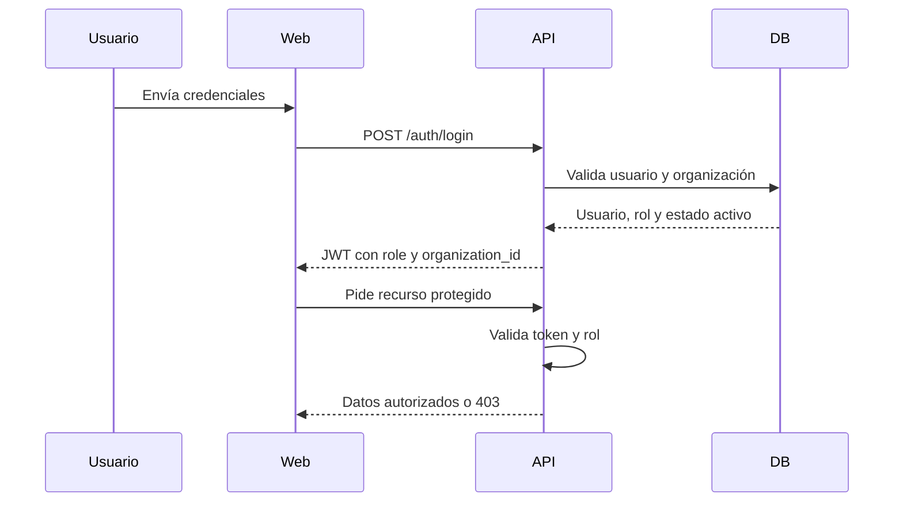

# Especificación de autenticación y permisos

## Propósito

Definir autenticación, autorización por roles y aislamiento por organización para AppGro.

## Audiencia

Implementadores backend y frontend.

## Referencias de origen

- `docs/projectPlan.md`
- `OLD/MainDocumentation/Survey/2025 APP-CAMPO.csv`

## Resumen de diseño

AppGro debe usar autenticación con JWT y RBAC del lado servidor. Todo acceso a datos queda acotado a la organización activa. Los perfiles de campo como `encargado`, `peon`, `agronomo` y `veterinario` se mapean a roles de sistema y, más adelante, a permisos por sector si hiciera falta.

## Diagrama

## Reglas y restricciones

- El JWT debe incluir user id, role y organization id.
- La autorización debe aplicarse en la capa de servicios, no solo en rutas.
- Los operadores solo pueden actuar sobre registros asignados o permitidos explícitamente.
- Los cambios sensibles deben dejar auditoría.

## Implicancias de roles y permisos

- Admin: gestión de usuarios, configuración y exportaciones completas
- Manager: gestión operativa y reporting
- Operator: ejecución de campo y actualizaciones limitadas
- Viewer: acceso de solo lectura

## Casos borde

- Usuarios inactivos deben fallar autenticación.
- Tokens de otra organización no deben resolver registros cruzados.
- Los fallos de permisos no deben filtrar detalles internos.

## Preguntas abiertas

- ¿Se requiere refresh token en la primera versión?
- ¿Los roles especialistas necesitan comportamiento de UI propio además del RBAC compartido?

## Notas de testabilidad

- Verificar matriz de roles por endpoint y servicio.
- Verificar denegación de acceso entre organizaciones.
- Verificar auditoría en mutaciones sensibles.
