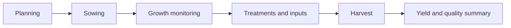

# Crops Specification

## Purpose

Define crop lifecycle tracking, treatments, yields, and weather-aware operational context.

## Audience

Developers implementing crop planning and field history.

## Source references

- `OLD/MainDocumentation/Survey/2025 APP-CAMPO.csv`
- `docs/projectPlan.md`

## Design summary

Crop tracking should follow the lifecycle from planning and sowing through treatment and harvest. Each crop record belongs to a sector and optionally a lote. Treatments, rainfall, and yield details are operational evidence, not incidental notes.

## Diagram

## Business rules and constraints

- Crop records require a sector and sowing date.
- Treatments must capture date, type, product, quantity, and unit.
- Harvest results should preserve actual yield and quality-related notes.
- Weather data may enrich analysis but should not replace manual agronomic records.

## Roles and permissions implications

- Agronomic users and managers manage treatments and yield interpretation.
- Operators can record field progress where allowed.

## Edge cases

- Cancelled crops must remain auditable.
- A sector may host sequential crop records across different periods.
- Missing estimated harvest dates should not block active tracking.
- Products used in treatments should be recorded even if not linked to a formal inventory system.

## Open questions

- Does the first version require rotation planning?
  - Not necessarily, rotation planning is a valuable feature for long-term agronomic strategy but may be deferred until core crop lifecycle tracking is established.
- Should rainfall be stored only in weather records or duplicated in crop summaries?
  - Rainfall data should be stored in weather records and can be referenced in crop summaries for analysis, but duplication should be minimized to avoid inconsistencies.

## Testability notes

- Verify lifecycle state transitions.
- Verify treatment data validation by units and date.
- Verify harvest reporting and yield calculations.
