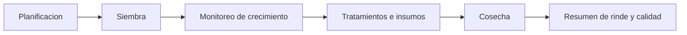

# Especificación de cultivos

## Propósito

Definir seguimiento del ciclo de cultivo, tratamientos, rindes y contexto operativo asociado al clima.

## Audiencia

Desarrolladores que implementan planificación agrícola e historial de campo.

## Referencias de origen

- `OLD/MainDocumentation/Survey/2025 APP-CAMPO.csv`
- `docs/projectPlan.md`

## Resumen de diseño

El seguimiento de cultivos debe cubrir el ciclo desde planificación y siembra hasta tratamientos y cosecha. Cada registro pertenece a un sector y opcionalmente a un lote. Los tratamientos, lluvias y datos de rinde son evidencia operativa, no notas accesorias.

## Diagrama

## Reglas y restricciones

- Los registros de cultivo requieren sector y fecha de siembra.
- Los tratamientos deben guardar fecha, tipo, producto, cantidad y unidad.
- Los resultados de cosecha deben preservar rinde real y notas de calidad.
- El clima puede enriquecer el análisis, pero no reemplaza registros agronómicos manuales.

## Implicancias de roles y permisos

- Usuarios agronómicos y managers gestionan tratamientos e interpretación de rindes.
- Operators pueden registrar avance de campo cuando la política lo permita.

## Casos borde

- Los cultivos cancelados deben seguir siendo auditables.
- Un sector puede alojar cultivos secuenciales en diferentes períodos.
- La falta de fecha estimada de cosecha no debe bloquear el seguimiento activo.

## Preguntas abiertas

- ¿La primera versión necesita planificación de rotación?
- ¿La lluvia debe vivir solo en weather o también resumirse en la ficha del cultivo?

## Notas de testabilidad

- Verificar transiciones de estado del ciclo.
- Verificar validación de tratamientos por unidades y fechas.
- Verificar reporting de cosecha y cálculos de rinde.
