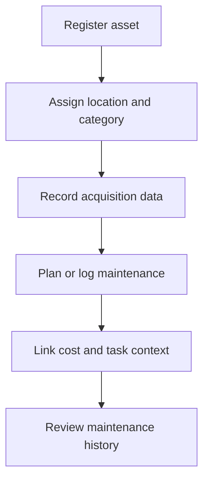

# Equipment and Maintenance Specification

## Purpose

Define records for tools, machinery, spare parts, and maintenance work.

## Audience

Developers implementing operational asset tracking.

## Source references

- `OLD/MainDocumentation/Survey/2025 APP-CAMPO.csv`

## Design summary

The survey explicitly requests records for tools, machinery, spare parts, locations, acquisition details, and maintenance sheets. The rewrite should treat equipment and maintenance as operational assets with financial and task links.

## Diagram

## Business rules and constraints

- Assets should have category, location, acquisition date, and optional quantity.
- Maintenance logs should be historical and auditable.
- Maintenance records may link to accounting movements and tasks.
- Infrastructure work such as fencing should be recordable even when not tied to a single machine.

## Roles and permissions implications

- Managers control asset registry and maintenance scheduling.
- Operators may log performed work where permitted.

## Edge cases

- Consumable spare parts may need stock-like behavior.
- Shared assets may move across sectors over time.

## Open questions

- Is preventive maintenance scheduling required in the first release?
  - Yes, preventive maintenance scheduling would be a useful feature but not critical for initial operational tracking, and could be added in a later phase once asset registration and corrective maintenance are established.
- Should inventory quantities be detailed for small tools and consumables?
  - Yes, tracking inventory quantities for small tools and consumables can help manage stock levels and ensure availability when needed.

## Testability notes

- Verify asset lifecycle history.
- Verify links between maintenance, tasks, and accounting records.
