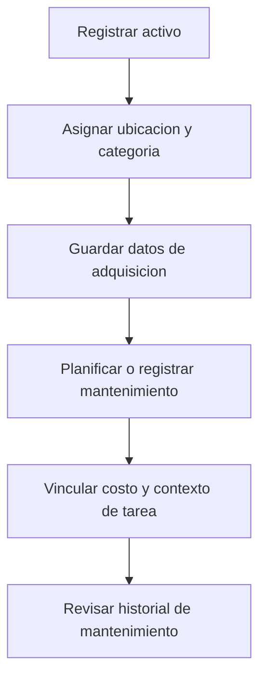

# Especificación de equipos y mantenimiento

## Propósito

Definir registros para herramientas, maquinarias, repuestos y trabajos de mantenimiento.

## Audiencia

Desarrolladores que implementan trazabilidad operativa de activos.

## Referencias de origen

- `OLD/MainDocumentation/Survey/2025 APP-CAMPO.csv`

## Resumen de diseño

La encuesta pide explícitamente registros de herramientas, maquinarias, repuestos, ubicaciones, datos de adquisición y fichas de mantenimiento. La reescritura debe tratar equipos y mantenimiento como activos operativos con vínculos a contabilidad y tareas.

## Diagrama

## Reglas y restricciones

- Los activos deben tener categoría, ubicación, fecha de adquisición y cantidad opcional.
- Los logs de mantenimiento deben ser históricos y auditables.
- Los registros de mantenimiento pueden vincularse con movimientos contables y tareas.
- Trabajos de infraestructura como alambrado deben poder registrarse aunque no dependan de una sola máquina.

## Implicancias de roles y permisos

- Managers controlan padrón de activos y programación de mantenimiento.
- Operators pueden registrar trabajo ejecutado cuando esté permitido.

## Casos borde

- Los repuestos consumibles pueden requerir comportamiento tipo stock.
- Los activos compartidos pueden moverse entre sectores en el tiempo.

## Preguntas abiertas

- ¿El mantenimiento preventivo calendarizado entra en la primera versión?
- ¿Se deben detallar cantidades de inventario para herramientas pequeñas y consumibles?

## Notas de testabilidad

- Verificar historial del ciclo de vida del activo.
- Verificar vínculos entre mantenimiento, tareas y contabilidad.
