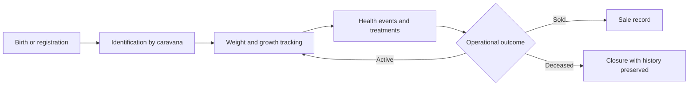

# Livestock Specification

## Purpose

Define livestock records, lifecycle events, health history, and operational reporting.

## Audience

Developers implementing animal tracking and reporting.

## Source references

- `OLD/MainDocumentation/Survey/2025 APP-CAMPO.csv`
- `OLD/MainDocumentation/NewTraditionsSolutions.docx.html`

## Design summary

Livestock tracking is centered on a unique `caravana` or equivalent identifier, current state, and immutable event history. The system should separate editable summary fields from append-only operational logs such as weight checks, treatments, and sales outcomes.

## Diagram

## Business rules and constraints

- Identifier uniqueness is required per organization.
- Weight logs and health events are historical records and should not be overwritten.
- Sale and death outcomes should close operational state without erasing history.
- Records may link to sector context and accounting events.

## Roles and permissions implications

- Operators can record observations and weight checks.
- Specialists can record veterinary actions.
- Managers can review trends and final outcomes.

## Edge cases

- Missing birth date must not block registration if identifier exists.
- Duplicate identifiers must fail validation.
- Manual state changes must not silently remove prior event evidence.

## Open questions

- Are breeding and reproduction records needed in the first wave?
  - They are not critical for initial operational tracking and can be added in a later phase once core lifecycle and health tracking is established.
- Should diet tracking be event-based or summarized on the main record?
  - Summarizing diet on the main record allows for easier access to current feeding information, while event-based tracking provides a more detailed history. The choice depends on the level of detail needed for operational decisions and reporting.

## Testability notes

- Verify uniqueness of identifier.
- Verify append-only behavior for health and weight history.
- Verify reporting on active, sold, and deceased animals.
