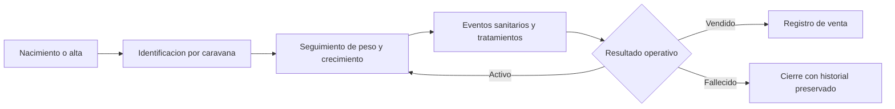

# Especificación de ganado

## Propósito

Definir registros de ganado, eventos de ciclo de vida, historial sanitario y reporting operativo.

## Audiencia

Desarrolladores que implementan trazabilidad animal y reporting.

## Referencias de origen

- `OLD/MainDocumentation/Survey/2025 APP-CAMPO.csv`
- `OLD/MainDocumentation/NewTraditionsSolutions.docx.html`

## Resumen de diseño

La trazabilidad de ganado se centra en una `caravana` o identificador equivalente, un estado actual y un historial inmutable de eventos. El sistema debe separar campos resumen editables de logs operativos append-only como pesajes, tratamientos y resultados de venta.

## Diagrama

## Reglas y restricciones

- La unicidad del identificador es obligatoria por organización.
- Los pesajes y eventos sanitarios son históricos y no deben sobreescribirse.
- Los resultados de venta o muerte deben cerrar el estado sin borrar historial.
- Los registros pueden vincularse a sector y eventos contables.

## Implicancias de roles y permisos

- Los operators registran observaciones y pesajes.
- Los especialistas registran acciones veterinarias.
- Los managers revisan tendencias y resultados finales.

## Casos borde

- La falta de fecha de nacimiento no debe bloquear el alta si existe identificador.
- Los identificadores duplicados deben fallar validación.
- Los cambios manuales de estado no deben eliminar evidencia previa.

## Preguntas abiertas

- ¿Se necesitan registros de reproducción en la primera ola?
  - No son críticos para el seguimiento operativo inicial y pueden añadirse en una fase posterior una vez que se establezca el seguimiento del ciclo de vida y la salud.
- ¿La dieta debe modelarse como eventos o como resumen en la ficha principal?
  - Resumir la dieta en la ficha principal permite un acceso más fácil a la información de alimentación actual, mientras que el seguimiento basado en eventos proporciona un historial más detallado. La elección depende del nivel de detalle necesario para las decisiones operativas y el reporting.

## Notas de testabilidad

- Verificar unicidad del identificador.
- Verificar comportamiento append-only para sanidad y peso.
- Verificar reporting de animales activos, vendidos y fallecidos.
