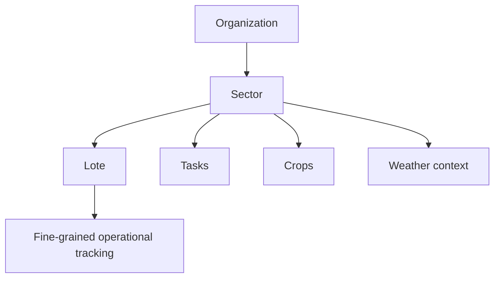

# Map, Sectors, and Lotes Specification

## Purpose

Define spatial organization, editable operational areas, and land-linked records.

## Audience

Developers implementing map, sector, and lote features.

## Source references

- `docs/projectPlan.md`
- `OLD/MainDocumentation/NewTraditionsSolutions.docx.html`

## Design summary

The map is operational, not decorative. Sectors and lotes anchor tasks, crops, livestock placement, and weather context. Labels, geometry, and area metadata should support filtering, assignment, and reporting.

## Diagram

## Business rules and constraints

- Sector names should be unique per organization.
- Lotes inherit the sector relationship but can carry their own identifiers and area.
- Records that reference land should prefer structured sector/lote relations over free text.
- Geometry editing must preserve audit context.

## Roles and permissions implications

- Managers and admins can create and edit sector structure.
- Operators may consume map context without editing geometry.

## Edge cases

- Historical records must remain linked even if sector labels change.
- Areas without final geometry should still support provisional records.
- Repartitioning land must not orphan historical tasks or crops.

## Open questions

- Is polygon editing required in the first release, or is structured metadata enough?
- Should livestock placement be point-in-time or only sector-level current state?

## Testability notes

- Verify uniqueness and referential integrity.
- Verify historical retention through map edits.
