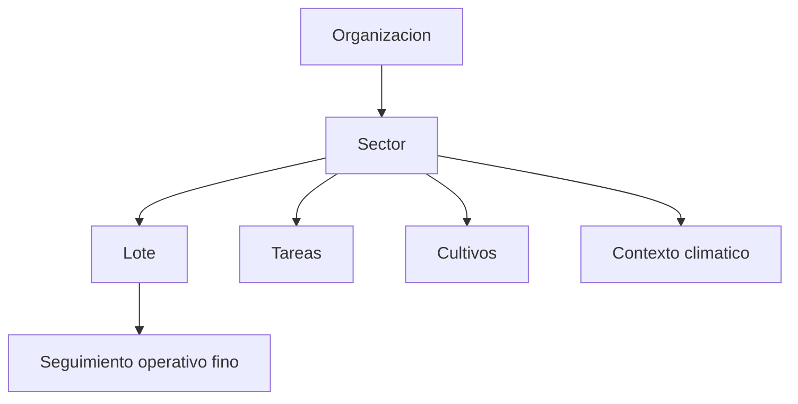

# Especificación de mapa, sectores y lotes

## Propósito

Definir organización espacial, áreas operativas editables y registros vinculados a la tierra.

## Audiencia

Desarrolladores que implementan funcionalidades de mapa, sector y lote.

## Referencias de origen

- `docs/projectPlan.md`
- `OLD/MainDocumentation/NewTraditionsSolutions.docx.html`

## Resumen de diseño

El mapa es operativo, no decorativo. Sectores y lotes anclan tareas, cultivos, ubicación de ganado y contexto climático. Etiquetas, geometría y metadatos de superficie deben soportar filtros, asignación y reporting.

## Diagrama

## Reglas y restricciones

- Los nombres de sector deben ser únicos por organización.
- Los lotes heredan la relación de sector, pero pueden tener identificador y superficie propios.
- Los registros que refieran a tierra deben preferir relaciones estructuradas sector/lote por sobre texto libre.
- La edición de geometría debe conservar contexto de auditoría.

## Implicancias de roles y permisos

- Managers y admins crean y editan la estructura territorial.
- Operators pueden consumir contexto del mapa sin editar geometría.

## Casos borde

- Los registros históricos deben seguir vinculados aunque cambie la etiqueta del sector.
- Las áreas sin geometría final igual deben soportar registros provisorios.
- Reparticionar tierra no debe dejar huérfanas tareas o cultivos históricos.

## Preguntas abiertas

- ¿La edición de polígonos es obligatoria en la primera versión o alcanza con metadatos estructurados?
  - Metadatos estructurados permiten asignar tareas y cultivos a sectores sin necesidad de geometría, lo que puede ser suficiente para la mayoría de casos operativos iniciales.
  - La edición de polígonos puede ser una funcionalidad valiosa para visualización y análisis espacial, pero podría posponerse para una versión posterior si no es crítica para las operaciones diarias. 
- ¿La ubicación del ganado debe modelarse por punto en el tiempo o solo por estado actual de sector?
  -  La ubicación del ganado por punto en el tiempo permitiría un seguimiento más detallado y análisis de movimientos, pero también requeriría una implementación más compleja.
  - Modelar solo el estado actual de sector es más sencillo y puede ser suficiente para muchas decisiones operativas, especialmente si el movimiento del ganado no es tan frecuente o crítico para las operaciones diarias.

## Notas de testabilidad

- Verificar unicidad e integridad referencial.
- Verificar retención histórica frente a cambios del mapa.
