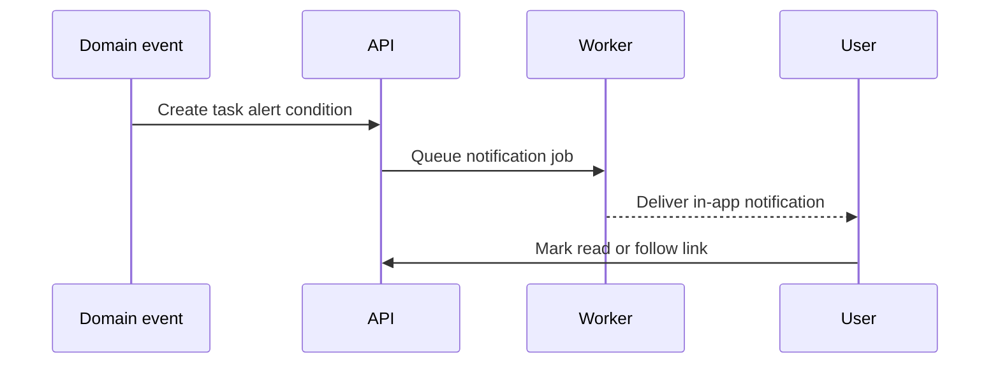

# Notifications Specification

## Purpose

Define in-app reminders and alerts tied to operational events.

## Audience

Developers implementing reminders, alerts, and user awareness flows.

## Source references

- `docs/projectPlan.md`
- `OLD/MainDocumentation/NewTraditionsSolutions.docx.html`

## Design summary

Notifications should surface meaningful action, not noise. Initial scope should prioritize in-app notifications for tasks, livestock alerts, and weather-relevant awareness, with optional outbound channels later.

## Diagram

## Business rules and constraints

- Notifications should reference the source entity when possible.
- Read state must be per user.
- Notification preferences should be user-specific and extensible by type.
- Reminders should be deduplicated where possible.

## Roles and permissions implications

- Users see only notifications derived from records they are allowed to access.

## Edge cases

- Deleted or cancelled source records must not leave broken notification links.
- Offline users need pending state reconciliation when reconnecting.

## Open questions

- Which outbound channels are needed after in-app delivery?
- Should escalation rules be time-based in the first release?

## Testability notes

- Verify visibility filtering by user and organization.
- Verify read/unread state and preference handling.
