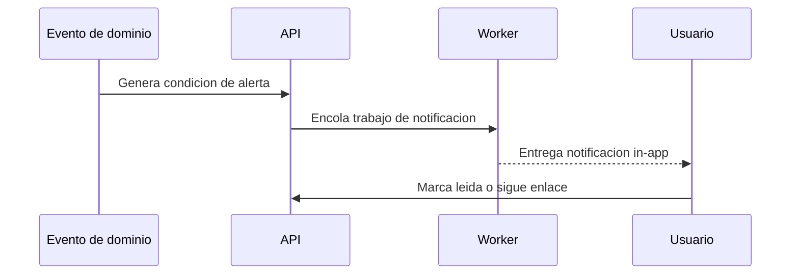

# Especificación de notificaciones

## Propósito

Definir recordatorios y alertas in-app vinculados a eventos operativos.

## Audiencia

Desarrolladores que implementan recordatorios, alertas y flujos de awareness para usuarios.

## Referencias de origen

- `docs/projectPlan.md`
- `OLD/MainDocumentation/NewTraditionsSolutions.docx.html`

## Resumen de diseño

Las notificaciones deben mostrar acción útil, no ruido. El alcance inicial debería priorizar notificaciones in-app para tareas, alertas de ganado y awareness climático, dejando canales salientes como extensión posterior.

## Diagrama

## Reglas y restricciones

- Las notificaciones deben referenciar la entidad origen cuando sea posible.
- El estado de lectura debe ser por usuario.
- Las preferencias deben ser específicas por usuario y extensibles por tipo.
- Los recordatorios deberían deduplicarse cuando sea posible.

## Implicancias de roles y permisos

- Cada usuario solo ve notificaciones derivadas de registros que puede acceder.

## Casos borde

- Registros origen borrados o cancelados no deben dejar enlaces rotos.
- Usuarios offline necesitan reconciliar estado pendiente al reconectar.

## Preguntas abiertas

- ¿Qué canales salientes se necesitan después del canal in-app?
- ¿Las reglas de escalamiento por tiempo entran en la primera versión?

## Notas de testabilidad

- Verificar visibilidad por usuario y organización.
- Verificar estado leído/no leído y preferencias.
