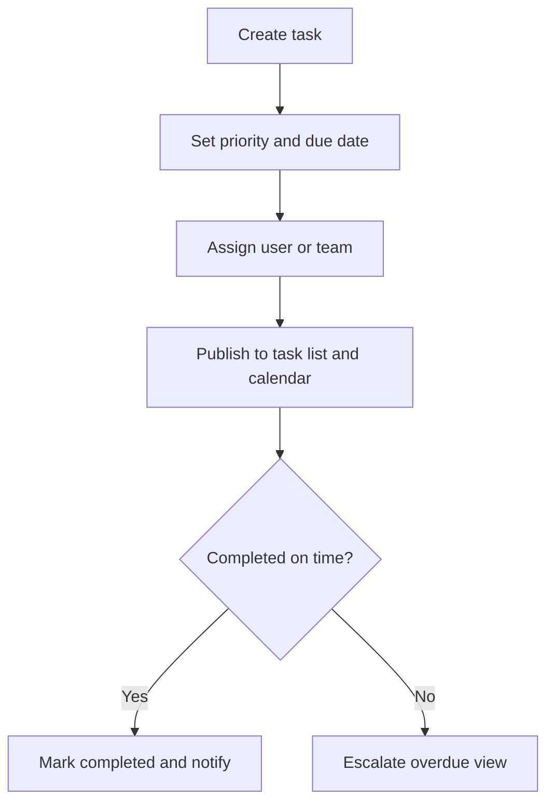

# Tasks and Calendar Specification

## Purpose

Define how AppGro handles planned work, assignment, priority, due dates, and calendar projection.

## Audience

Developers implementing task management and scheduling features.

## Source references

- `docs/projectPlan.md`
- `OLD/MainDocumentation/NewTraditionsSolutions.docx.html`

## Design summary

Tasks are first-class operational records. Each task has priority, status, due date, assignee, and optional sector/lote context. The calendar is a projection of task deadlines and statuses, not a separate source of truth.

## Diagram

## Business rules and constraints

- Priority ordering must be explicit: low, medium, high, urgent.
- Calendar entries are derived from task due dates and status changes.
- Tasks should preserve completion metadata and comments.
- Task deletion should be exceptional; cancellation is safer than hard delete.

## Roles and permissions implications

- Managers and admins create and assign tasks.
- Operators update task progress on assigned work.
- Viewers can inspect tasks only where policy allows.

## Edge cases

- Overdue tasks must remain visible until completed or cancelled.
- Reassignment must keep original creation history.
- Offline completion needs queued sync and visible pending state.

## Open questions

- Does the first release need recurring tasks?
  - Recurring tasks would be useful for daily or weekly routines, but they could be added in a later phase to focus first on managing unique tasks and their integration with the calendar.
- Should sector-level bulk assignment be included from the start?
  - For the first release, it is not a requirement, but sector-level bulk assignment could be a valuable feature for operations managing large areas or multiple lots, and could be planned for a later phase once the basic task functionality is established.

## Testability notes

- Verify priority sorting, overdue detection, and calendar projection.
- Verify permission limits on reassignment and cancellation.
