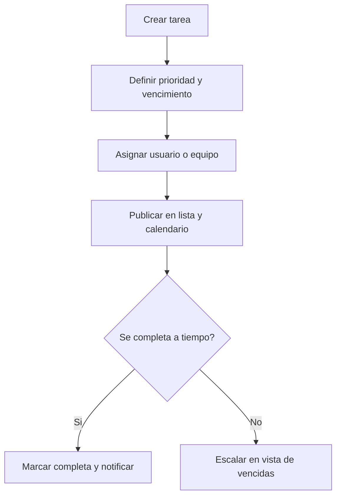

# Especificación de tareas y calendario

## Propósito

Definir cómo AppGro gestiona trabajo planificado, asignación, prioridad, vencimientos y proyección en calendario.

## Audiencia

Desarrolladores que implementan gestión de tareas y programación.

## Referencias de origen

- `docs/projectPlan.md`
- `OLD/MainDocumentation/NewTraditionsSolutions.docx.html`

## Resumen de diseño

Las tareas son registros operativos de primera clase. Cada tarea tiene prioridad, estado, fecha límite, responsable y contexto opcional de sector/lote. El calendario es una proyección de vencimientos y estados de tareas, no una fuente de verdad separada.

## Diagrama

## Reglas y restricciones

- El orden de prioridad debe ser explícito: low, medium, high, urgent.
- Las entradas del calendario se derivan de fecha límite y cambios de estado.
- Las tareas deben conservar metadatos de finalización y comentarios.
- Borrar tareas debe ser excepcional; cancelar es más seguro que hard delete.

## Implicancias de roles y permisos

- Managers y admins crean y asignan tareas.
- Operators actualizan progreso sobre trabajo asignado.
- Viewers inspeccionan tareas solo donde la política lo permita.

## Casos borde

- Las tareas vencidas deben seguir visibles hasta completarse o cancelarse.
- La reasignación debe mantener historial de creación original.
- La finalización offline necesita cola de sync y estado pendiente visible.

## Preguntas abiertas

- ¿La primera versión necesita tareas recurrentes?
  - Tareas recurrentes serían útiles para rutinas diarias o semanales, pero podrían añadirse en una fase posterior para enfocarse primero en la gestión de tareas únicas y su integración con el calendario.
- ¿Debe incluirse asignación masiva por sector desde el inicio?
  - Para primer versión no es requisito, pero la asignación masiva por sector podría ser una funcionalidad valiosa para operaciones que gestionan grandes áreas o múltiples lotes, y podría planificarse para una fase posterior una vez que la funcionalidad básica de tareas esté establecida.

## Notas de testabilidad

- Verificar orden por prioridad, detección de vencidas y proyección al calendario.
- Verificar límites de permisos sobre reasignación y cancelación.
