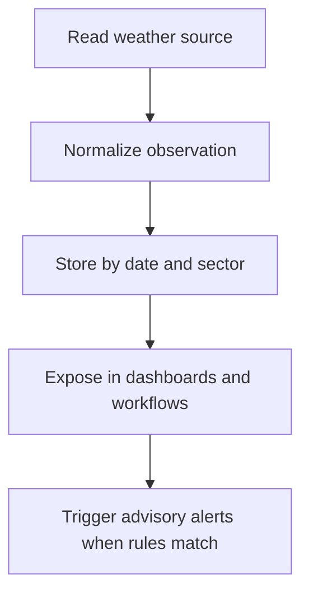

# Weather Specification

## Purpose

Define how weather context supports operational decisions without replacing manual field judgment.

## Audience

Developers implementing weather ingestion and contextual display.

## Source references

- `docs/projectPlan.md`
- `OLD/MainDocumentation/NewTraditionsSolutions.docx.html`

## Design summary

Weather should inform tasks, crops, and alerts. The first version should support externally sourced observations and optionally manual observations. Weather context is advisory unless later rules explicitly automate decisions.

## Diagram

## Business rules and constraints

- Observations should store source and timestamp.
- Sector-level weather context is preferred over global-only values.
- Automated actions should not occur without explicit documented rules.

## Roles and permissions implications

- Most users can read weather context.
- Configuration of integrations should remain administrative.

## Edge cases

- Missing provider data should degrade gracefully.
- Manual observations should remain distinguishable from external provider data.

## Open questions

- Which provider or station source is preferred?
- Is forecast support required at launch, or only observations?

## Testability notes

- Verify normalization of provider payloads.
- Verify source attribution and date filtering.
