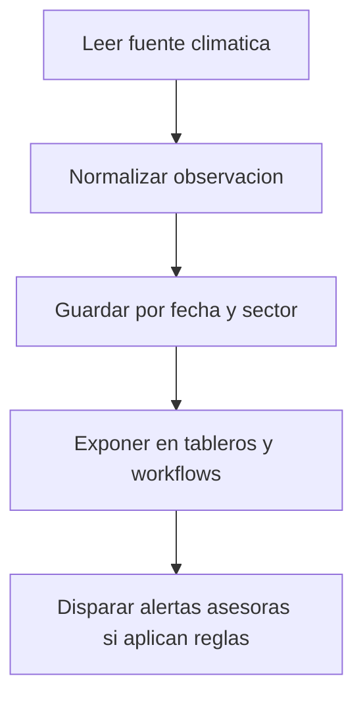

# Especificación de clima

## Propósito

Definir cómo el contexto climático apoya decisiones operativas sin reemplazar el criterio manual de campo.

## Audiencia

Desarrolladores que implementan ingestión climática y visualización contextual.

## Referencias de origen

- `docs/projectPlan.md`
- `OLD/MainDocumentation/NewTraditionsSolutions.docx.html`

## Resumen de diseño

El clima debe informar tareas, cultivos y alertas. La primera versión debería soportar observaciones de fuente externa y, opcionalmente, observaciones manuales. El contexto climático es asesor, salvo que reglas futuras automaticen decisiones de manera explícita.

## Diagrama

## Reglas y restricciones

- Las observaciones deben guardar fuente y timestamp.
- Se prefiere contexto climático por sector sobre valores globales solamente.
- No deben ejecutarse acciones automáticas sin reglas documentadas explícitamente.

## Implicancias de roles y permisos

- La mayoría de usuarios puede leer contexto climático.
- La configuración de integraciones debe quedar en manos administrativas.

## Casos borde

- La falta de datos del proveedor debe degradar con elegancia.
- Las observaciones manuales deben distinguirse de datos externos.

## Preguntas abiertas

- ¿Qué proveedor o estación será la fuente preferida?
- ¿Se necesita pronóstico al lanzamiento o solo observaciones?

## Notas de testabilidad

- Verificar normalización de payloads del proveedor.
- Verificar atribución de fuente y filtrado por fecha.
