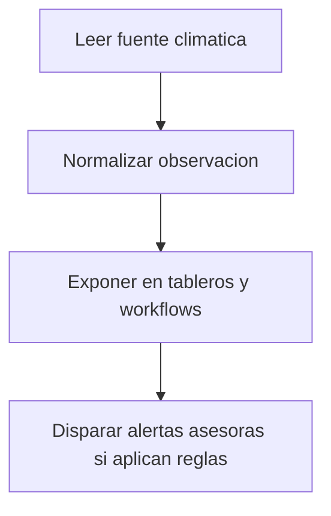

# Especificación de clima

## Propósito

Definir cómo el contexto climático apoya decisiones operativas sin reemplazar el criterio manual de campo.

## Audiencia

Desarrolladores que implementan ingestión climática y visualización contextual.

## Referencias de origen

- `docs/projectPlan.md`
- `OLD/MainDocumentation/NewTraditionsSolutions.docx.html`

## Resumen de diseño

El clima debe informarse sobre los sectores relevantes, con atribución clara de fuente y timestamp.
Se prioriza la normalización de datos para facilitar la toma de decisiones, pero no se automatizan acciones sin reglas explícitas.
La información debe ser accesible para la mayoría de usuarios, pero la configuración de integraciones queda en manos administrativas.

## Diagrama

## Reglas y restricciones

- Las observaciones deben guardar fuente y timestamp.
- Se prefiere contexto climático por sector sobre valores globales solamente.
- No deben ejecutarse acciones automáticas sin reglas documentadas explícitamente.

## Implicancias de roles y permisos

- La mayoría de usuarios puede leer contexto climático.
- La configuración de integraciones debe quedar en manos administrativas.

## Casos borde

- La falta de datos del proveedor debe degradar con elegancia.
- Las observaciones manuales deben distinguirse de datos externos.

## Preguntas abiertas

- ¿Qué proveedor o estación será la fuente preferida?
  - Usuario podría elegir entre varias fuentes, pero inicialmente podríamos integrar con un proveedor popular y confiable para asegurar datos de calidad desde el lanzamiento (WeatherAPI).
- ¿Se necesita pronóstico al lanzamiento o solo observaciones?
  - Dependiendo del proveedor, podríamos incluir pronósticos básicos para los próximos días, pero inicialmente podríamos enfocarnos en observaciones actuales para validar la funcionalidad antes de agregar pronósticos.

## Notas de testabilidad

- Verificar normalización de payloads del proveedor.
- Verificar atribución de fuente y filtrado por fecha.
