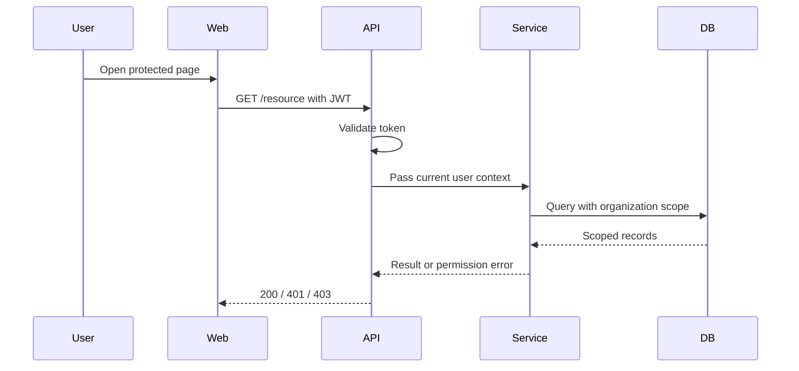
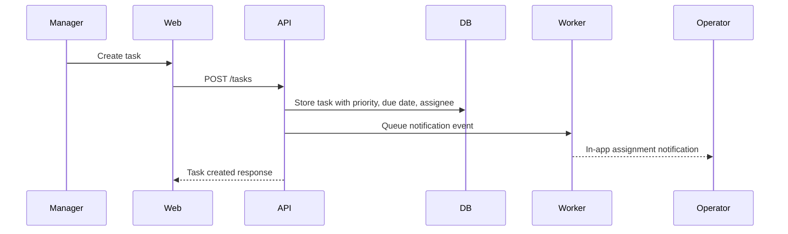
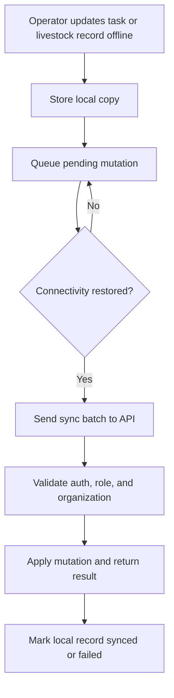

# Core Workflows

## Purpose

Document the primary cross-module workflows required to start implementation safely.

## Audience

Frontend and backend implementers.

## Source references

- `docs/projectPlan.md`
- `OLD/MainDocumentation/NewTraditionsSolutions.docx.html`
- `OLD/MainDocumentation/Survey/2025 APP-CAMPO.csv`

## Workflow 1 - Authenticated request with role enforcement

## Workflow 2 - Task assignment and notification

## Workflow 3 - Offline field update and sync

## Workflow rules

- Offline changes must never be silently discarded.
- Server validation remains authoritative after reconnect.
- Conflict resolution must be explicit and user-visible when needed.

## Open questions

- Should the first release use a generic batch sync endpoint or domain-specific endpoints only?
- How should failed offline mutations be surfaced to users who have low digital literacy?

## Testability notes

- Verify task-notification linkage.
- Verify sync retry and failed-state handling.
- Verify permission enforcement during sync replay.
