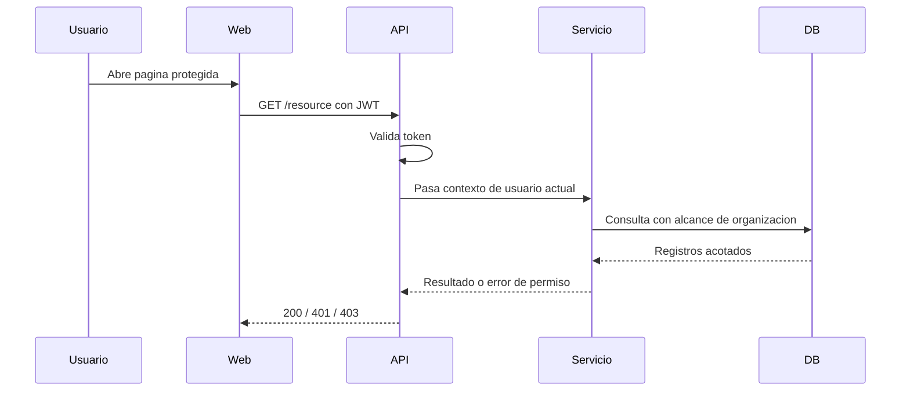
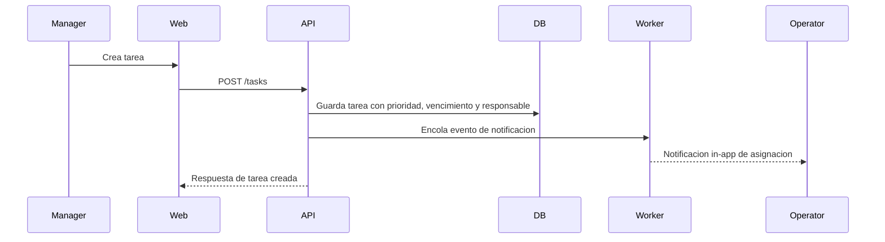
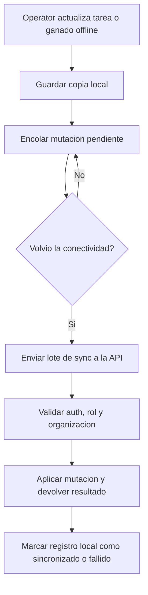

# Flujos núcleo

## Propósito

Documentar los flujos principales entre módulos necesarios para comenzar la implementación de forma segura.

## Audiencia

Implementadores de frontend y backend.

## Referencias de origen

- `docs/projectPlan.md`
- `OLD/MainDocumentation/NewTraditionsSolutions.docx.html`
- `OLD/MainDocumentation/Survey/2025 APP-CAMPO.csv`

## Flujo 1 - Solicitud autenticada con control de roles

## Flujo 2 - Asignación de tarea y notificación

## Flujo 3 - Actualización offline de campo y sync

## Reglas de workflow

- Los cambios offline nunca deben descartarse silenciosamente.
- La validación del servidor sigue siendo autoritativa al reconectar.
- La resolución de conflictos debe ser explícita y visible para el usuario cuando haga falta.

## Preguntas abiertas

- ¿La primera versión usará un endpoint genérico de sync por lotes o solo endpoints por dominio?
- ¿Cómo deben mostrarse las mutaciones offline fallidas a usuarios con baja alfabetización digital?

## Notas de testabilidad

- Verificar vínculo entre tarea y notificación.
- Verificar reintentos de sync y manejo de estado fallido.
- Verificar permisos durante el replay del sync.
